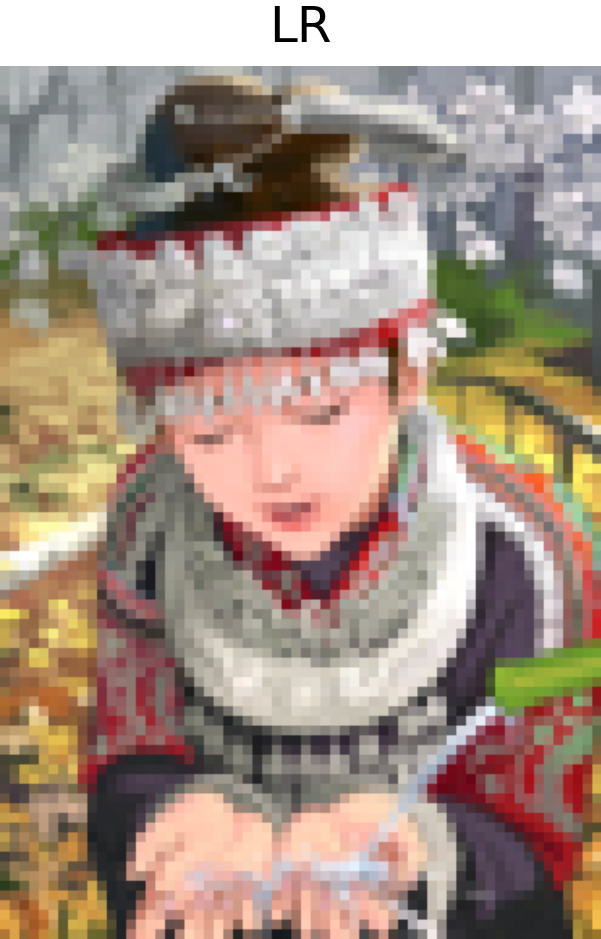
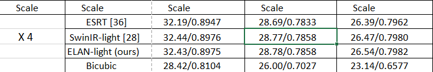

# Image Super-Resolution using Lightweight DAT

This repository contains an implementation of an Image Super-Resolution (SR) model using a **Lightweight Deformable Attention Transformer (DAT)**. The model is trained on the **DF2K dataset**, a combination of DIV2K and Flickr2K datasets, to achieve high-quality upscaling of low-resolution images with reduced computational cost.

## Table of Contents
- [Introduction](#introduction)
- [Dataset](#dataset)
- [Model](#model)
- [Training](#training)
- [Results](#results)
- [References](#references)

## Introduction
Image Super-Resolution aims to enhance the resolution of low-resolution images while preserving details and minimizing artifacts. This project leverages the power of a **Lightweight Deformable Attention Transformer (DAT)** for high-fidelity image reconstruction while maintaining efficiency.

## Dataset
We use the **DF2K dataset**, which is a combination of:
- **DIV2K**: A dataset of high-quality images used in SR research.
- **Flickr2K**: A collection of high-resolution images sourced from Flickr.

The dataset provides diverse textures and details that help in learning fine-grained super-resolution mappings.

## Model
The model is based on a **Lightweight DAT (Deformable Attention Transformer)**, which employs deformable attention mechanisms to effectively focus on important regions of an image for super-resolution. 

### Key Modifications in Lightweight DAT:
- **Reduced Number of Channels**: From 180 to **60**
- **Reduced Number of Blocks**: From 6 to **4**
- **Reduced Attention Heads**: From 6 to **4**
- **Number of Parameters**: **760K**
- 

### Key Features of DAT:
- Adaptive feature refinement
- Efficient attention mechanism
- High-quality image reconstruction with reduced computational cost

## Training
The model is trained using DF2K with the following settings:
- **Loss Function**: L1 Loss
- **Optimizer**: Adam with initial learning rate 1e-3
- **Batch Size**: 16
- **Training Steps**: 360 epochs

## Results
Below are sample results of our model's performance:

  
  
  

<!--  -->

The model achieves high-quality image enhancement with minimal artifacts and sharp details.

## References
- [DAT: Dual Aggregation Transformer for Image Super-Resolution](https://arxiv.org/pdf/2308.03364)
- [DF2K Dataset](https://data.vision.ee.ethz.ch/cvl/DIV2K/)

---
Feel free to contribute or report issues!

